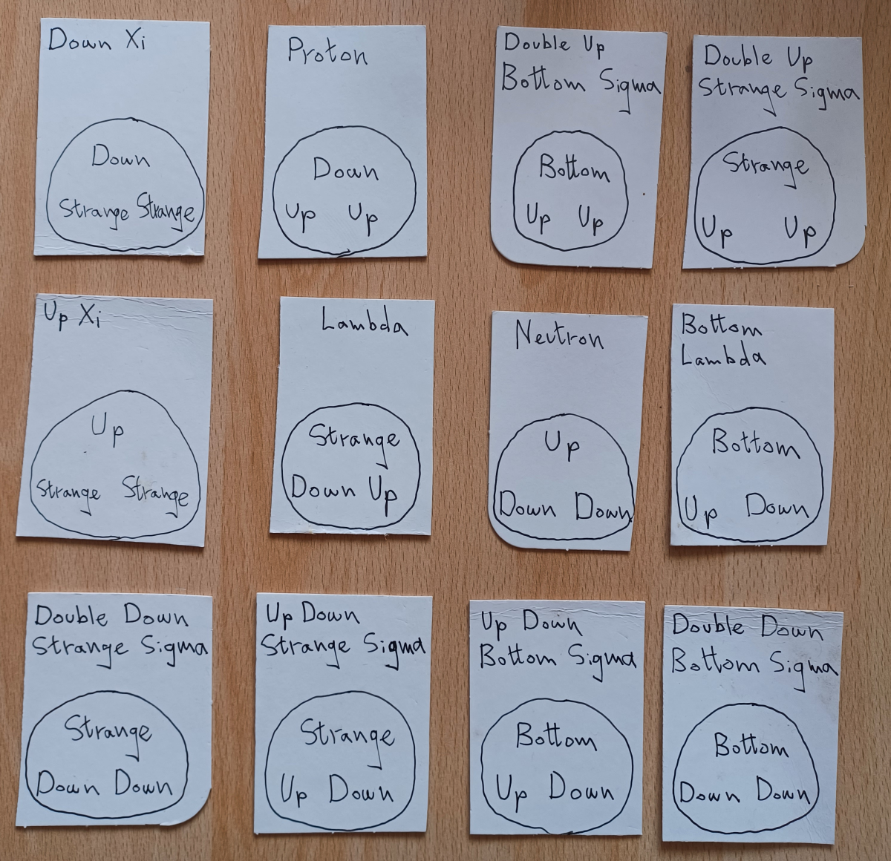
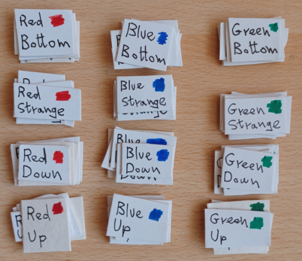
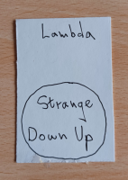
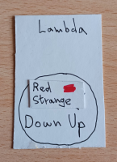
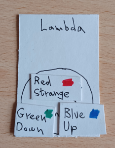

# Baryon Bingo

A game of subatomic bingo where the winner is the first to get all the quarks to make
their [baryon](https://en.wikipedia.org/wiki/Baryon)!

## Making The Cards

First you need to make your cards. Here are the baryon cards you need to make:

and these are the quark cards you need to make (each stack contains about six cards
that are the same as each other):

## Rules

A person is appointed the 'caller', and they give a baryon card to each player. Then
the caller jumbles up the quark cards and picks one at random and calls out which it
is, eg. "red strange". If a player needs a Strange quark of that colour then she shouts
out, "Bary!" and puts the quark card on its position. It may be that more than one
person needs that card, in which case the first person to shout, "Bary!" gets it. When
a player has all three quarks their baryon is complete and they shout out,
"Baryon Bingo!" to show they've won. The final rule is that all the quarks on a baryon
card have to be of different colours.

So for example, say we have a player called Florence, and she has this Baryon Card:

Then if the caller says, "red strange", Florence shouts out "Bary!" and puts the quark
card on its position so it looks like:

If the caller then says, "red down", then Florence shouldn't shout "Bary!" because
because then there would be two reds, and all the quark in a baryon must be of different
colours. If she does shout out "Bary!" and she can't use the quark card, then as a
penalty she has to give back one of her quark cards to the caller. Once Florence has
collected all three quark cards of different colours the card will look like:

and Florence shouts out, "Baryon Bingo!" and wins the game!

## Technical Note

`pandoc README.md --standalone --output=README.html --metadata title="Baryon Bingo"`

 This work is licensed under a <a rel="license" href="http://creativecommons.org/licenses/by/4.0/">Creative Commons Attribution 4.0 International License</a>.
